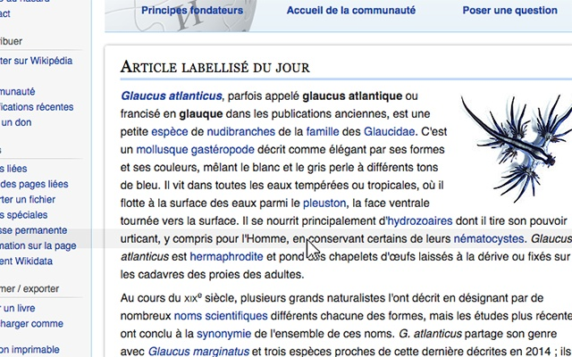

# ReadingLine

The Chrome Extension for easy line tracking when reading. Acts as a reading ruler, helping to keep an eye on a line of text with a mouse.

# Data Protection FAQ

- Does the extension collect any user data?
  - No, the Reading Ruler does not collect any kind of data.

- Does the extension track users?
  - No, the Reading Ruler does not track users.

- Does the extension send data to any server?
  - No, the Reading Ruler does not use any kind of server connection. All the processing is doing locally.

- Why does the extension need 'read and change websites' permission?
  - Because the Reading Ruler needs the information of website elements to calculate and render the ruler.
